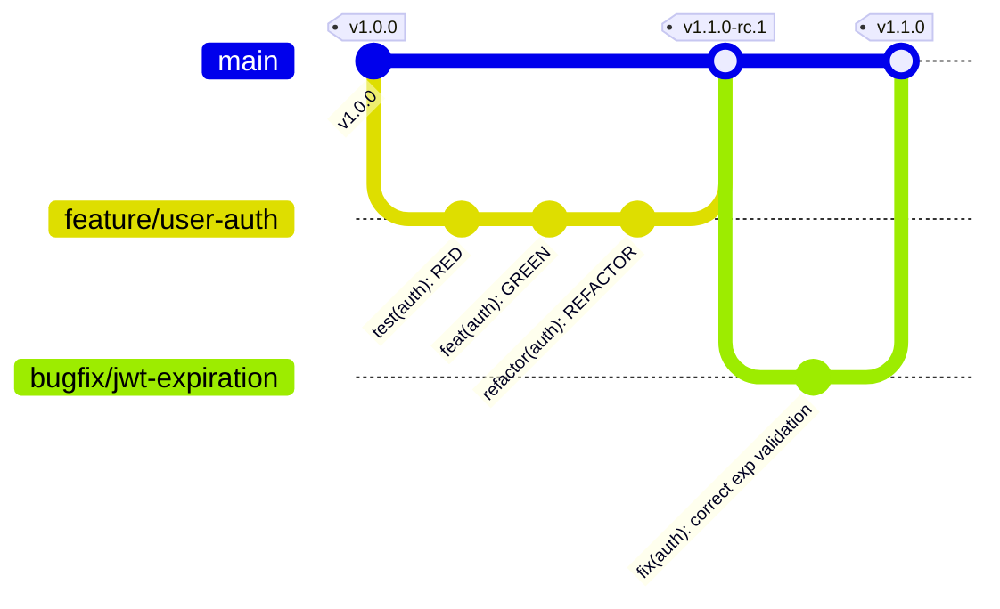

# Git Strategy Specification
## Car Dealership Inventory System

---

## 1. Commit Message Conventions

This project enforces the **Conventional Commits 1.0.0** specification. Structured commit messages enable automated changelog generation and simplify codebase search.

### Message Format
Each commit message must consist of a **header**, a **body**, and a **footer**. The header has a special format that includes a **type**, a **scope**, and a **description**:

```text
<type>(<scope>): <description>

[optional body]

[optional footer(s)]
```

### Commit Types
*   `feat`: A new feature mapping directly to a user requirement.
*   `fix`: A bug fix resolving a failing test or user issue.
*   `docs`: Documentation changes only (e.g., Markdown files).
*   `style`: Changes that do not affect the meaning of the code (white-space, formatting, semi-colons).
*   `refactor`: A code change that neither fixes a bug nor adds a feature (improving structural layout).
*   `test`: Adding missing tests or correcting existing tests.
*   `chore`: Changes to the build process, auxiliary tools, or libraries (e.g., dependency updates).

### Scopes
Scope must refer to the specific module or feature area being modified:
*   `auth`: Authentication (registration, login, JWT logic).
*   `inventory`: Vehicle ledger (creation, update, filter queries).
*   `reservations`: Active vehicle holds.
*   `sales`: Financial transaction processing.
*   `config`: Global configurations, environments, or Docker files.
*   `db`: Prisma schema, migrations, or database configurations.

---

### Examples of Good Commit Messages

#### 1. Adding a New Feature (with Scope and Body)
```text
feat(inventory): add pagination support to car search query

Implements pagination filtering parameters (page, limit) to the GET /cars route.
Enforces a maximum page limit of 100 elements to prevent memory overload.

Closes #142
```

#### 2. Fixing a Security Exception
```text
fix(auth): prevent token reuse by deleting compromised active hashes

Intercepts token refresh requests and, if reuse is detected, revokes
all active sessions associated with the user ID to mitigate token theft.
```

#### 3. Refactoring Code Layout (During TDD Refactor Stage)
```text
refactor(reservations): extract reservation status checks into domain service

Moves logical validation checks determining if a car is eligible for
reservations from the Use Case class to ReservationDomainService.
```

---

## 2. Branching Strategy: GitHub Flow

To maintain agility and ensure continuous integration, this project uses **GitHub Flow**. It relies on short-lived feature branches and enforces linear history on the main branch.



### Branch Naming Conventions
*   **Feature Branches**: `feature/<feature-name>` (e.g., `feature/car-validation`, `feature/token-rotation`).
*   **Bugfix Branches**: `bugfix/<issue-name>` (e.g., `bugfix/jwt-expiry-check`).
*   **Hotfix Branches**: `hotfix/<critical-issue-name>` (e.g., `hotfix/db-connection-leak`).
*   **Release Branches**: `release/v<version-number>` (e.g., `release/v1.2.0`).

### Pull Request & Merging Guidelines
1.  **Creation**: Every change must happen on an isolated feature/bugfix branch branched off `main`.
2.  **Continuous Integration**: Pushing to a branch automatically runs the test suite (Vitest) and linters (ESLint).
3.  **Mandatory Review**: A Pull Request must be reviewed by at least one other engineer before merging.
4.  **Squash & Merge**: All commits on the feature branch are squashed into a single, clean Conventional Commit when merging into `main`. This maintains a linear, clean history.

---

## 3. TDD Commit Sequence (RED, GREEN, REFACTOR)

TDD requires specific commits at key stages to document the development process and maintain code safety.

```text
 TDD Stage  │ Commit Timing                    │ Example Commit Message
 ───────────┼──────────────────────────────────┼───────────────────────────────────────────────────────────
   RED      │ Immediately after writing a      │ test(inventory): add failing registration vin length spec
            │ compilation-validated test that  │
            │ fails as expected.               │
 ───────────┼──────────────────────────────────┼───────────────────────────────────────────────────────────
  GREEN     │ Immediately after implementing   │ feat(inventory): implement car vin length constraint
            │ the minimal code necessary to    │
            │ make the failing test pass.      │
 ───────────┼──────────────────────────────────┼───────────────────────────────────────────────────────────
  REFACTOR  │ Immediately after refactoring    │ refactor(inventory): optimize vin formatting logic
            │ implementation code without      │
            │ breaking passing tests.          │
```

### Trigger Rules: When Each Commit Should Happen
*   **RED Commit**:
    *   *Trigger*: Write a new unit/integration test. Run the test suite. Verify that the test compiles but fails (fails the assertion, not compilation error).
    *   *Action*: Commit immediately. Do not write implementation code yet. This proves the test is capable of failing.
*   **GREEN Commit**:
    *   *Trigger*: Write the minimal implementation code to pass the test. Run the test suite. All tests must pass.
    *   *Action*: Commit immediately. Do not refactor yet. This secures the working state.
*   **REFACTOR Commit**:
    *   *Trigger*: Clean up duplicate code, optimize variable names, split functions, or extract domain models. Run the test suite to ensure tests remain green.
    *   *Action*: Commit immediately. This records the structural improvement.

---

## 4. Chronological Feature Development Order

To build the application systematically, features are developed in a dependency-first order:

```text
Phase 1: DB & Auth Domain ---> Phase 2: Auth Use Cases ---> Phase 3: Inventory Ledger ---> Phase 4: Holds & Sales
(User model, Migrations)     (Login, Refresh, Logout)      (Car CRUD, filter queries)    (Reservations, Ledger)
```

### 1. Database Setup & Auth Domain (Phase 1)
*   **Task 1**: Configure database schemas, enums, and initial migrations.
    *   *Commit*: `chore(db): initialize postgres schema and migrations`
*   **Task 2**: Implement User domain invariants via TDD.
    *   *Commit (RED)*: `test(auth): add user domain email constraint test`
    *   *Commit (GREEN)*: `feat(auth): implement user domain constructor validations`

### 2. Authentication & Session Services (Phase 2)
*   **Task 1**: Implement `RegisterUser` use case and hash algorithms.
    *   *Commit (RED)*: `test(auth): add register user interactors test`
    *   *Commit (GREEN)*: `feat(auth): implement register user business logic`
*   **Task 2**: Implement Login and token generation.
    *   *Commit (RED)*: `test(auth): add user login session validation test`
    *   *Commit (GREEN)*: `feat(auth): implement login token generation logic`

### 3. Car Inventory Ledger (Phase 3)
*   **Task 1**: Implement Car domain rules.
    *   *Commit (RED)*: `test(inventory): add car vin and price constraint test`
    *   *Commit (GREEN)*: `feat(inventory): implement car domain invariants`
*   **Task 2**: Implement Car CRUD use cases.
    *   *Commit (RED)*: `test(inventory): add car creation interactors test`
    *   *Commit (GREEN)*: `feat(inventory): implement car inventory persistence`

### 4. Reservation Holds & Sales Transactions (Phase 4)
*   **Task 1**: Implement Reservation lifecycle holds.
    *   *Commit (RED)*: `test(reservations): add reservation state machine validation test`
    *   *Commit (GREEN)*: `feat(reservations): implement create hold interactors logic`
*   **Task 2**: Implement Sales transaction ledgers.
    *   *Commit (RED)*: `test(sales): add double-selling prevention test`
    *   *Commit (GREEN)*: `feat(sales): implement sales transaction ledger persistence`

---

## 5. Release Strategy (SemVer & Tagging)

We use **Semantic Versioning 2.0.0** (SemVer) to manage releases: `MAJOR.MINOR.PATCH`.

*   **PATCH**: Backward-compatible bug fixes (e.g., resolving a memory leak).
*   **MINOR**: Backward-compatible new functionality (e.g., adding a new report export API).
*   **MAJOR**: Incompatible API changes (e.g., changing JWT payloads or database schemas).

### Release Cycle
1.  **Branch Release**: Create a release branch off `main` (e.g., `release/v1.1.0`).
2.  **Release Candidate Testing**: Run integration and E2E tests. Fix any release bugs on this branch.
3.  **Merge**: Merge `release/v1.1.0` into `main`.
4.  **Git Tagging**: Create a git tag on the merge commit:
    ```bash
    git tag -a v1.1.0 -m "Release version 1.1.0 containing inventory pagination and reservation logs"
    git push origin v1.1.0
    ```

---

## 6. Repository Best Practices

### 1. Main Branch Protection
Configure branch protection rules on GitHub for `main`:
*   Require Pull Request before merging.
*   Require status checks to pass (CI build, ESLint, and all Vitest suites must pass).
*   Require at least 1 approving review.
*   Enforce linear history (block standard merge commits, allow squash merges only).

### 2. Pre-Commit Hooks (Husky & lint-staged)
Configure hooks to prevent committing malformed code:
*   **Pre-commit Hook**: Runs `lint-staged`.
    *   For staged JS/TS files, run `eslint --fix` and `vitest related --run`.
*   **Commit-msg Hook**: Runs `commitlint` to verify commit message conforms to Conventional Commits format.

### 3. Git Conflict Resolution Strategy
Avoid resolving conflicts on GitHub. Always resolve them locally:
1.  Fetch updates from main: `git checkout main && git pull origin main`
2.  Switch back to the feature branch: `git checkout feature/car-validation`
3.  Rebase the feature branch onto main: `git rebase main`
4.  Resolve any conflicts locally. Run tests to confirm correctness: `npm run test`
5.  Force push safely: `git push origin feature/car-validation --force-with-lease`
