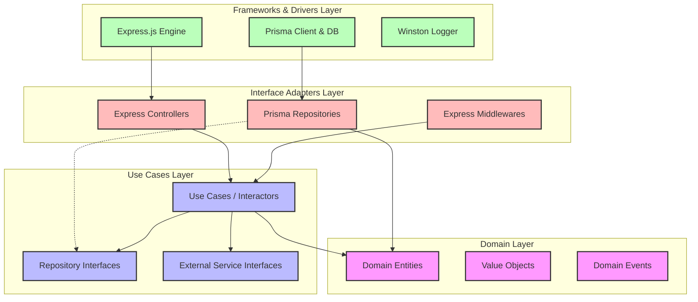
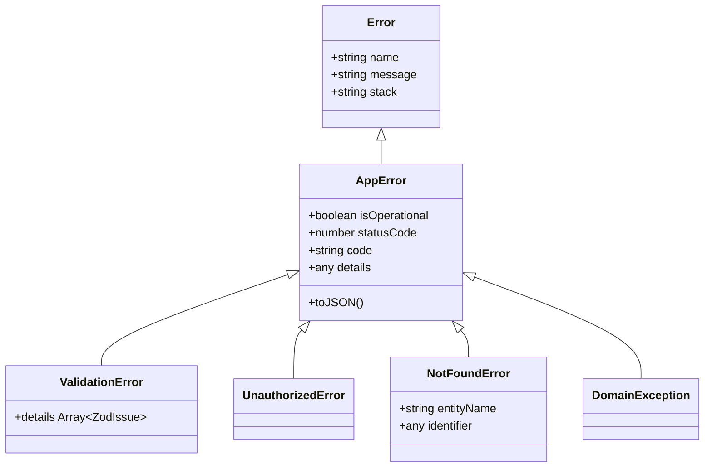
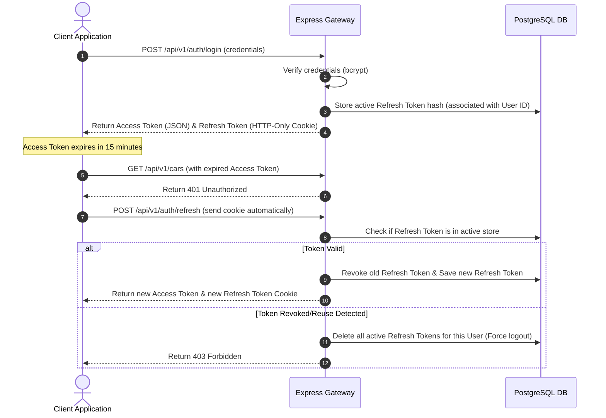
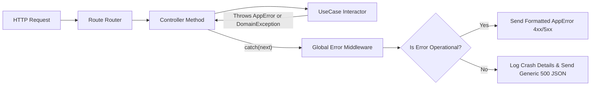
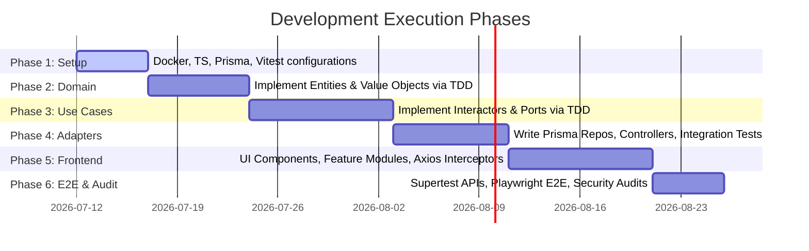

# System Architecture Specification
## Car Dealership Inventory System

---

## 1. Clean Architecture Overview & Dependency Flow

This system is designed using Robert C. Martin's (Uncle Bob) **Clean Architecture** guidelines. The primary goal is the **Separation of Concerns**, ensuring that business logic is completely isolated from frameworks, databases, UI, and external drivers. 

### Core Architectural Layers

1. **Enterprise Business Rules (Domain / Entities)**
   - Represents the core business concepts (e.g., `Car`, `User`, `Dealership`, `Deal`).
   - Contains business logic that is highly stable and does not change when databases or frameworks change.
   - Designed using pure TypeScript objects and classes. Contains zero dependencies on database clients (like Prisma), Express, or validation libraries (like Zod) at compile-time.

2. **Application Business Rules (Use Cases)**
   - Contains application-specific business rules.
   - Coordinates the flow of data to and from the entities.
   - Exposes interfaces (abstractions) for external concerns, such as database repositories, file storage, or email services.
   - Directs entities to execute their business logic to fulfill a use case (e.g., `AddCarToInventory`, `ProcessSaleTransaction`, `RotateUserTokens`).

3. **Interface Adapters**
   - Translates data between the format most convenient for the Use Cases/Entities and the format most convenient for external agents (like database or web).
   - Contains:
     - **Controllers**: Parse HTTP requests, validate input schemas, call use cases, and hand results to Presenters/Response formatters.
     - **Repositories (Gateways)**: Concrete implementations of interfaces defined in the Use Cases layer. They handle database operations (using Prisma) and map database rows back to pure Domain Entities.
     - **Presenters**: Format use case output data into specific API response view-models.

4. **Frameworks & Drivers**
   - The outermost layer, containing concrete tools and technologies:
     - **Express.js**: Web framework for routing and HTTP server handling.
     - **Prisma Client & PostgreSQL**: Data persistence mechanism.
     - **Winston**: Structured logging system.
     - **Jose/JWT & Bcrypt**: Encryption and token security mechanisms.

---

### Dependency Flow Diagram

The **Dependency Rule** is absolute: **Dependencies must point inwards**. Inner layers must have no knowledge of outer layers. Outer layers talk to inner layers through interfaces (Dependency Inversion).



---

## 2. Detailed Directory Layouts

### Backend Directory Layout (`/backend`)
```text
backend/
├── prisma/
│   ├── schema.prisma             # Prisma Database Schema Definition
│   └── migrations/               # SQL Migration Files
├── src/
│   ├── app.ts                    # Express Application Bootstrap
│   ├── server.ts                 # HTTP Server Listener Entry Point
│   │
│   ├── @types/                   # Express Ambient Type Extensions
│   │   └── express.d.ts
│   │
│   ├── domain/                   # Layer 1: Domain Entities & Invariants (No Outer Dependencies)
│   │   ├── entities/
│   │   │   ├── Car.ts
│   │   │   └── User.ts
│   │   ├── value-objects/
│   │   │   ├── Vin.ts            # Vehicle Identification Number Value Object
│   │   │   └── Email.ts
│   │   └── exceptions/
│   │       └── DomainException.ts
│   │
│   ├── use-cases/                # Layer 2: Business Logic Interactors & Abstractions
│   │   ├── car/
│   │   │   ├── AddCar.ts
│   │   │   ├── GetInventory.ts
│   │   │   └── SellCar.ts
│   │   ├── auth/
│   │   │   ├── RegisterUser.ts
│   │   │   └── LoginUser.ts
│   │   ├── ports/                # Output Port Interfaces (Dependency Inversion)
│   │   │   ├── ICarRepository.ts
│   │   │   ├── IUserRepository.ts
│   │   │   └── IHashService.ts
│   │   └── dto/                  # Request/Response Data Transfer Objects
│   │       ├── CarDTOs.ts
│   │       └── AuthDTOs.ts
│   │
│   ├── adapters/                 # Layer 3: Controllers, Repositories, Presenters
│   │   ├── controllers/
│   │   │   ├── CarController.ts
│   │   │   └── AuthController.ts
│   │   ├── repositories/         # Prisma Repository Implementations
│   │   │   ├── PrismaCarRepository.ts
│   │   │   └── PrismaUserRepository.ts
│   │   ├── presenters/           # REST API JSON Formatting Presenters
│   │   │   └── CarPresenter.ts
│   │   └── services/             # Third-party wrappers (Bcrypt, JWT)
│   │       ├── BcryptHashService.ts
│   │       └── JwtTokenService.ts
│   │
│   └── infrastructure/           # Layer 4: Express, Prisma Client, Logger, Config
│       ├── config/
│       │   └── environment.ts    # Zod Environment Configuration
│       ├── database/
│       │   └── prisma-client.ts  # Singleton Prisma Client Instance
│       ├── express/
│       │   ├── routes/
│       │   │   ├── index.ts
│       │   │   ├── car.routes.ts
│       │   │   └── auth.routes.ts
│       │   └── middlewares/
│       │       ├── error.middleware.ts
│       │       ├── auth.middleware.ts
│       │       ├── role.middleware.ts
│       │       ├── rate-limiter.middleware.ts
│       │       └── validation.middleware.ts
│       └── logging/
│           └── winston.ts        # Structured JSON Winston Logger Configuration
│
└── tests/                        # Automated Tests Directory
    ├── unit/                     # Domain & Use Case Tests (Isolated)
    │   ├── domain/
    │   └── use-cases/
    ├── integration/              # Controllers & Repository Database Tests
    │   ├── api/
    │   └── repositories/
    └── setup.ts                  # Vitest Global Test Environment Configurations
```

### Frontend Directory Layout (`/frontend`)
```text
frontend/
├── public/
│   └── favicon.ico
├── src/
│   ├── main.tsx                  # Vite App Entry Point
│   ├── App.tsx                   # React Routing & Provider Container
│   ├── index.css                 # Tailwind Utility Imports & CSS Variables
│   │
│   ├── config/                   # Global Config & Variables (Validated by Zod)
│   │   └── env.ts
│   │
│   ├── core/                     # Clean Architecture Framework Layer
│   │   ├── api/
│   │   │   └── apiClient.ts      # Axios Instance with Request/Response Interceptors
│   │   ├── theme/
│   │   │   └── tokens.css        # Pure CSS Variables (Harmonious Color Palette)
│   │   └── routes/
│   │       ├── ProtectedRoute.tsx
│   │       └── AppRoutes.tsx
│   │
│   ├── components/               # Domain-agnostic Atomic UI Elements (Reusable)
│   │   ├── ui/
│   │   │   ├── Button.tsx
│   │   │   ├── Input.tsx
│   │   │   ├── Table.tsx
│   │   │   ├── Badge.tsx
│   │   │   └── Dialog.tsx
│   │   └── layout/
│   │       ├── Sidebar.tsx
│   │       ├── Header.tsx
│   │       └── DashboardLayout.tsx
│   │
│   ├── features/                 # Vertical Slice Modules (Feature-Based Layout)
│   │   ├── auth/
│   │   │   ├── components/
│   │   │   │   └── LoginForm.tsx
│   │   │   ├── hooks/
│   │   │   │   └── useAuth.ts    # React Query Auth Mutations
│   │   │   ├── types/
│   │   │   │   └── index.ts      # Authentication specific models
│   │   │   └── pages/
│   │   │       └── LoginPage.tsx
│   │   │
│   │   ├── inventory/
│   │   │   ├── components/
│   │   │   │   ├── CarTable.tsx
│   │   │   │   ├── CarFilterBar.tsx
│   │   │   │   └── AddCarModal.tsx
│   │   │   ├── hooks/
│   │   │   │   ├── useInventory.ts # React Query Query hooks
│   │   │   │   └── useCarMutations.ts
│   │   │   ├── services/
│   │   │   │   └── carService.ts  # Axios HTTP abstractions
│   │   │   └── pages/
│   │   │       ├── InventoryPage.tsx
│   │   │       └── CarDetailsPage.tsx
│   │   │
│   │   └── dashboard/
│   │       ├── components/
│   │       │   └── MetricCard.tsx
│   │       └── pages/
│   │           └── DashboardOverviewPage.tsx
│   │
│   ├── hooks/                    # Domain-agnostic Global Custom Hooks
│   │   ├── useTheme.ts
│   │   └── useDebounce.ts
│   │
│   ├── context/                  # Global React Contexts
│   │   └── AuthContext.tsx       # Auth State Provider
│   │
│   └── utils/                    # Global Pure Functions
│       ├── formatters.ts         # Currency & Date Formatters
│       └── assertions.ts
│
└── tests/                        # Vitest + React Testing Library Tests
    ├── components/
    ├── features/
    └── setup.ts
```

---

## 3. Layer Responsibilities

### Backend Layer Responsibilities
*   **Domain Layer**: Pure entities that dictate domain invariants. Example: Creating a `Car` entity requires validation of its status (e.g., `Available`, `Reserved`, `Sold`). It must protect itself against invalid mutations at all times.
*   **Use Cases Layer**: Represents a specific task requested by an actor. It retrieves the required domain models from abstract repositories, issues instructions to the domain models, and persists changes through abstract repository interfaces. It enforces application-specific rules (e.g., ensuring a user is logged before editing inventories).
*   **Interface Adapters Layer**: Bridges use cases to specific delivery mechanics. 
    *   *Controllers* parse route parameters, execute validations, extract the payload, execute a use case, and format the output.
    *   *Repositories* fetch raw data from databases (e.g., PostgreSQL using Prisma client queries) and reconstruct pure domain entities using constructors or factory patterns.
*   **Infrastructure Layer**: Standard configuration setup for Express routes, third-party libraries (e.g., Helmet, CORS, Winston), and loading environment configurations securely.

### Frontend Layer Responsibilities
*   **Core Layer**: Holds configurations, API Axios client setups (interceptors for refreshing tokens), and global routing contexts.
*   **UI Components Layer**: Dumb, reusable presentational elements. They do not know about use cases, API formats, or network conditions. They rely solely on React props.
*   **Features Layer**: Structured as vertical slices containing sub-folders for pages, logical sub-components, react-query hooks, API calls, and types. This structure limits context switching and localizes updates.
*   **Hooks & Contexts**: Orchestrate state management. React Query handles server-state synchronization (caching, garbage collection, and optimistic updates), while React Context manages global app state (e.g., currentUser details).

---

## 4. Folder Responsibilities

### Backend Folders
*   `src/domain/`: Code stored here cannot import any node module from the dependencies block (except pure utility types or mathematical/date operations). This isolates domain rules.
*   `src/use-cases/ports/`: Interfaces specifying operations needed for persistence or notification (e.g., `ICarRepository`, `IEmailService`). Implementing libraries are kept in the adapters folder, satisfying the Dependency Inversion Principle.
*   `src/adapters/controllers/`: Gatekeepers for routing. Express routes delegate execution directly to them.
*   `src/infrastructure/express/middlewares/`: Global interceptors handling security headers, body parsing, auth tokens, input validation, and structured error responses.

### Frontend Folders
*   `src/components/ui/`: Atomic elements (buttons, inputs, select-menus) derived from styling frameworks.
*   `src/features/`: Modules built around explicit domain concepts. By breaking code by feature instead of technology (e.g., putting all forms in `components/forms/`), features can be safely added or removed.
*   `src/core/api/`: Manages centralized network calls. Intercepts `401 Unauthorized` responses to initiate silent refresh token requests without user intervention.

---

## 5. Naming Conventions

To maintain uniformity, predictable file naming, and easy code searching, the project adheres to the following standards:

### Case & Suffix Conventions

| File Type | Casing Convention | Suffix | Example |
| :--- | :--- | :--- | :--- |
| **Domain Entity** | PascalCase | None | `Car.ts` |
| **Value Object** | PascalCase | None | `Vin.ts` |
| **Repository Port (Interface)** | PascalCase | Pre-fixed with `I` | `ICarRepository.ts` |
| **Repository Adapter (Class)** | PascalCase | `Repository.ts` | `PrismaCarRepository.ts` |
| **Use Case (Class)** | PascalCase | None | `AddCar.ts` |
| **Controller** | PascalCase | `Controller.ts` | `CarController.ts` |
| **Express Route** | kebab-case | `.routes.ts` | `car-routes.ts` |
| **Zod Schema** | camelCase | `Schema.ts` | `carCreateSchema.ts` |
| **React Component** | PascalCase | `.tsx` extension | `CarCard.tsx` |
| **React Hook** | camelCase | Pre-fixed with `use` | `useInventory.ts` |
| **Service Adapter** | PascalCase | `Service.ts` | `BcryptHashService.ts` |

### Coding Standards
*   **Class Names**: PascalCase (e.g., `class AddCarUseCase`).
*   **Methods & Functions**: camelCase (e.g., `execute(dto: AddCarDTO): Promise<Car>`).
*   **Variable Names**: camelCase (e.g., `const carInventoryList = ...`).
*   **TypeScript Interfaces**: PascalCase. No prefix for entity mappings, but pre-fixed with `I` for repository patterns or dependency inversion ports (e.g., `ICarRepository`).
*   **Database Tables & Fields**: PascalCase for models in Prisma, camelCase for column fields. Database keys map to standard snake_case internally inside PostgreSQL.

---

## 6. Error Handling Strategy

Our architecture enforces a strict division between **Operational Errors** (runtime errors that are anticipated, such as invalid credentials or unique key violations) and **Programmer Errors** (unexpected system failures, such as null pointer reference or database connection failure).

### Exception Hierarchy

We define a base class `AppError` that extends `Error`. All planned operational errors inherit from it.



### Operational vs. Programmer Errors
*   **Operational Errors**: Handled gracefully. They are instantiated with custom messages, a standard custom code, and a HTTP Status Code. The global Express error middleware catches these and returns a clean, structured JSON format to the frontend.
*   **Programmer Errors**: These errors trigger immediate logging at the `error` level (including full stack trace). The process should fail fast and restart automatically in production using a container orchestrator (e.g., PM2 or Kubernetes) to prevent memory leaks or corrupted system states.

---

## 7. Validation Strategy

Validation is implemented at multiple boundaries to protect the database from corruption, validate client inputs, and maintain domain models in valid states.

```text
[ Client Web App ] ---> [ Zod Request Validator Middleware ] ---> [ Use Case ] ---> [ Domain Entity Invariants ] ---> [ Database Schema Constraints ]
```

### Request Payload Validation (Zod)
*   **Execution Location**: Express Routing middleware before the request reaches the controller.
*   **Behavior**: Evaluates `req.body`, `req.query`, and `req.params`.
*   **Validation Failures**: Short-circuits the pipeline and throws a `ValidationError`. This error is converted by our global handler into an structured JSON error map (400 Bad Request) detailing target fields.

### Domain Invariants Validation
*   **Execution Location**: Domain Entities (e.g., `Car` class constructor or static factory method `Car.create()`).
*   **Behavior**: Enforces domain-specific invariants that Zod cannot easily check, such as business logic consistency (e.g., "A car cannot be marked as Sold unless a customer ID is linked").
*   **Validation Failures**: Throws a `DomainException`. This ensures that a domain entity can never be created or mutated into an invalid state in memory.

### Frontend Validation
*   **Execution Location**: React Hook Form combined with the Zod resolver (`@hookform/resolvers/zod`).
*   **Behavior**: Schemas are shared between the frontend and backend codebase where possible. Forms display real-time inline errors, disabling submit options until schemas are fully satisfied.

---

## 8. Authentication Strategy

We use a state-of-the-art **Stateless Token-Based Authentication Flow** utilizing JSON Web Tokens (JWT) with **Access and Refresh Token Rotation**.

### Token Lifecycle & Attributes

1.  **Access Token**:
    *   **Lifespan**: Short-lived (15 minutes).
    *   **Payload**: User ID, Role, and Email.
    *   **Transmission**: Passed via the HTTP `Authorization: Bearer <Access_Token>` header.
    *   **Verification**: Verified in memory by the API server using JWT signing keys.

2.  **Refresh Token**:
    *   **Lifespan**: Long-lived (7 days).
    *   **Storage**: Handled in a secure, HTTP-only, `SameSite=Strict`, `Secure` (HTTPS only) cookie. This setup shields the token from Cross-Site Scripting (XSS) attacks.
    *   **Transmission**: Attached automatically by browsers to credentialed HTTP requests.

### Token Rotation Process



---

## 9. Authorization Strategy

Authorization is implemented using **Role-Based Access Control (RBAC)**, verified via custom Express middlewares.

### Roles and Permissions Matrix

The application supports three roles: `Admin`, `Manager`, and `Sales Representative`.

| System Action | Sales Representative | Manager | Admin |
| :--- | :---: | :---: | :---: |
| **View Inventory** | Yes | Yes | Yes |
| **Add Car to Inventory** | No | Yes | Yes |
| **Modify Car Status (Reserved/Sold)** | Yes | Yes | Yes |
| **Modify Car Pricing/Details** | No | Yes | Yes |
| **Delete Car Record** | No | No | Yes |
| **Manage Users & Settings** | No | No | Yes |

### Declarative Route Protection Middleware
Routes are protected declaratively by passing required roles to an authorization middleware:

```typescript
// Interface representation for architectural review
router.post(
  '/cars',
  authMiddleware,
  roleMiddleware(['ADMIN', 'MANAGER']), // Declarative restriction
  validationMiddleware(createCarSchema),
  carController.create
);
```

### Resource-Level Authorization Policies
For checks that require assessing the resource itself (e.g., "A Sales Rep can edit a reservation only if they created it"), the system uses a **Policy Interceptor** in the Use Case layer:

```typescript
interface IAuthorizationPolicy<TResource> {
  isAuthorized(user: CurrentUser, resource: TResource): boolean;
}
```

---

## 10. Logging Strategy

A production-grade, structured logging strategy is configured using **Winston**. This facilitates integration with log collectors (e.g., ELK Stack, Datadog, or Grafana Loki).

### Structured Log Configurations
*   **Format**: JSON format in all environments. This ensures logs are queryable via JSON fields rather than regex string matching.
*   **Segregation by Level**:
    *   `error`: Standard system crashes, exceptions, database failures (contains `stack` trace).
    *   `warn`: Validation failures, failed logins, bad requests.
    *   `info`: Application events (database migration successful, server started, token refreshed).
    *   `debug`: Detailed API performance metrics, database query traces (disabled in production).

### Winston Log Transport Schema
*   **Console Transport**: Standard output with timestamp mapping, log levels, and request trace IDs.
*   **File Transport**: Log files are rotated daily (using `winston-daily-rotate-file`) to prevent disk depletion. Logs are stored in `logs/error-%DATE%.log` and `logs/combined-%DATE%.log`.
*   **PII Masking**: Custom transport formatter to automatically scrub sensitive data like fields named `password`, `token`, `cardNumber`, or `email` before exporting logs to disk.

---

## 11. Environment Configuration

To prevent configuration errors during startup, environment configurations are loaded and validated on boot using **Zod**.

### Type-Safe Environment Schema Config
We define a schema mapping for both backend and frontend configs. The application crashes immediately on boot with a message detailing any missing or malformed configuration variables.

```typescript
// Schema configuration interface (Design abstraction)
export const environmentSchema = z.object({
  NODE_ENV: z.enum(['development', 'test', 'production']),
  PORT: z.string().transform(Number).default('5000'),
  DATABASE_URL: z.string().url(),
  JWT_ACCESS_SECRET: z.string().min(32),
  JWT_REFRESH_SECRET: z.string().min(32),
  CORS_ORIGIN: z.string().url(),
  LOG_LEVEL: z.enum(['error', 'warn', 'info', 'debug']).default('info'),
});

export type EnvConfig = z.infer<typeof environmentSchema>;
```

On the frontend, variables are prefixed with `VITE_` and checked similarly on application bootstrap inside `src/config/env.ts`.

---

## 12. API Response Format

To ensure API clients can parse payload and error exceptions predictably, the API implements a standardized **JSend-compliant response envelope**.

### Success Envelope
Used when a request completes successfully (HTTP Status `200` or `201`).
```json
{
  "success": true,
  "data": {
    "car": {
      "id": "uuid-v4-string",
      "make": "Toyota",
      "model": "RAV4",
      "year": 2024,
      "price": 38500
    }
  },
  "meta": {
    "timestamp": "2026-07-11T09:34:00Z"
  }
}
```

### Paginated Success Envelope
```json
{
  "success": true,
  "data": [
    { "id": "1", "make": "Honda" }
  ],
  "meta": {
    "page": 1,
    "limit": 10,
    "totalCount": 145,
    "totalPages": 15,
    "timestamp": "2026-07-11T09:34:00Z"
  }
}
```

### Error Envelope
Used when a client error or system error occurs (HTTP Status `4xx` or `5xx`).
```json
{
  "success": false,
  "error": {
    "statusCode": 400,
    "code": "VALIDATION_FAILED",
    "message": "The request payload did not pass validation.",
    "details": [
      {
        "field": "price",
        "message": "Price must be a positive number"
      }
    ]
  },
  "meta": {
    "timestamp": "2026-07-11T09:34:00Z"
  }
}
```

---

## 13. Exception Handling

Centralized exception handling prevents route controller code from containing repetitive `try/catch` statements and prevents leak of database internals to API clients.

### Express Centralized Exception Pipeline

All routing controllers use a wrapper function or an Express async handler library so that thrown errors are caught and forwarded to the global Express error middleware:



### Global Process Interceptors
To avoid server state corruption from unhandled exceptions, the server listens for process hooks:
```typescript
process.on('uncaughtException', (error) => {
  logger.error('CRITICAL: Uncaught Exception thrown:', error);
  process.exit(1); // Exit and allow orchestrator to restart
});

process.on('unhandledRejection', (reason) => {
  logger.error('CRITICAL: Unhandled Promise Rejection:', reason);
  process.exit(1);
});
```

---

## 14. Security Best Practices

Our system implements modern web security standards.

*   **Security Headers (Helmet)**: Sets standard headers to protect against cross-site scripting (XSS) and clickjacking. Configures strict Content Security Policy (CSP).
*   **Cross-Origin Resource Sharing (CORS)**: Configured with a strict whitelist. Wildcards (`*`) are disallowed. Credentials are set to true to allow passing secure httpOnly cookies.
*   **Rate Limiting**: Configured using `express-rate-limit` globally (max 100 requests per 15 minutes per IP), with strict rules for auth endpoints (e.g., `POST /auth/login` restricted to 5 attempts per 15 minutes).
*   **Password Hashing**: Implemented using `bcrypt` with `12` salt rounds. Hashing runs out-of-band to prevent processor locking on the main Node event loop.
*   **SQL Injection Prevention**: Prisma ORM is utilized for persistence. All interactions are parameterized to prevent raw input execution in Postgres.
*   **Cross-Site Request Forgery (CSRF) Protection**: Mitigated by utilizing the `SameSite=Strict` and `httpOnly` attributes for auth cookies. This limits cookie transmission to first-party origins.

---

## 15. SOLID Principles Applied

The system uses SOLID principles to ensure code maintainability and testability.

### 1. Single Responsibility Principle (SRP)
*   **Application**: Each class or file handles one conceptual task. A Controller is only responsible for parsing HTTP packets and delegating to Use Cases. It does not validate domain invariants or write SQL database scripts.
*   **Example**: The Use Case class `AddCar` is only responsible for the logic of adding a vehicle. It does not handle image uploading or logging.

### 2. Open/Closed Principle (OCP)
*   **Application**: System structures are open for extension but closed for modification.
*   **Example**: To support another search method (e.g., Elasticsearch instead of PostgreSQL), we create a class that implements `ICarRepository`. The `GetInventory` use case remains unchanged.

### 3. Liskov Substitution Principle (LSP)
*   **Application**: Derived classes must be substitutable for their base types without altering system behavior.
*   **Example**: `PrismaCarRepository` and an in-memory repository for unit tests `MockCarRepository` both satisfy `ICarRepository`. Subbing one for the other does not break the `AddCar` use case.

### 4. Interface Segregation Principle (ISP)
*   **Application**: Clients should not be forced to depend on interfaces they do not use. We split large, monolithic interfaces into smaller, cohesive contracts.
*   **Example**: Rather than having a single database interface `IRepository`, we define `ICarRepository` and `IUserRepository` separately.

### 5. Dependency Inversion Principle (DIP)
*   **Application**: High-level modules (Use Cases) do not depend on low-level modules (Prisma Database Adapter). Both depend on abstractions (Repository Ports).
*   **Example**: High-level `AddCar` use case depends on interface `ICarRepository`. Low-level `PrismaCarRepository` implements `ICarRepository`.

---

## 16. Complete Development Roadmap

To ensure a structured implementation following **Test-Driven Development (TDD)**, development is split into 6 sequential phases.



### Phase 1: Setup & Initialization
*   **Task 1**: Scrape backend and frontend structures. Configure `tsconfig.json`, `eslint`, and `prettier` options.
*   **Task 2**: Initialize Docker Compose configuration for local PostgreSQL service.
*   **Task 3**: Create Prisma schema and generate initial database migrations.
*   **Task 4**: Configure Vitest environment files and run a sample test to confirm execution.

### Phase 2: Domain Layer (TDD Cycles)
*   **Task 1**: Write unit tests for `Car` and `User` entities with validation rules.
*   **Task 2**: Implement domain code to pass tests (validate statuses, prices, formatting).
*   **Task 3**: Write tests and code for custom Value Objects (`Vin.ts`, `Email.ts`).

### Phase 3: Use Cases Layer (TDD Cycles)
*   **Task 1**: Define ports interfaces (`ICarRepository`, `IUserRepository`, `IHashService`).
*   **Task 2**: Write tests for use cases (`AddCar`, `GetInventory`, `SellCar`, `LoginUser`) using Mock repositories.
*   **Task 3**: Implement use case interactors to pass the mocks.

### Phase 4: Adapters & Routing Integration
*   **Task 1**: Implement concrete repository classes (`PrismaCarRepository`, `PrismaUserRepository`).
*   **Task 2**: Write integration tests using test database setups to verify query mappings.
*   **Task 3**: Develop routing middleware (auth, validation, error handler) and Controllers.
*   **Task 4**: Verify routing layers using Supertest integration suites.

### Phase 5: Frontend Features Implementation
*   **Task 1**: Scaffolding Vite React code, linking Tailwind configurations and Google Fonts.
*   **Task 2**: Create reusable UI components (`Button`, `Table`, `Input`) and test via React Testing Library.
*   **Task 3**: Develop core network handlers (Axios client with automatic Token Refresh hook).
*   **Task 4**: Develop slices sequentially (Authentication feature slice, Inventory feature slice).

### Phase 6: Final Integration & E2E Testing
*   **Task 1**: Configure full End-to-End testing suites (Playwright).
*   **Task 2**: Run security checklists (e.g., OWASP top 10 auditing, package dependency checks).
*   **Task 3**: Setup build outputs and run production bundlers (`npm run build`).

---

## 17. Architectural Rationales (The "Why")

### Why Clean Architecture over simple MVC?
*   **Reasoning**: In Express MVC projects, controllers, database models, and routes often become tightly coupled. Clean Architecture keeps database dependencies outside core use cases. This makes domain logic easier to test in isolation without requiring complex database mocks or runners.

### Why Vitest & Supertest over Jest?
*   **Reasoning**: Vitest is faster than Jest because it uses Vite’s dev server transformations. It provides ESM support out-of-the-box, which simplifies configuring TypeScript. Supertest integrates well with Express for testing HTTP routes without starting the web server.

### Why Prisma ORM over raw SQL or Knex?
*   **Reasoning**: Prisma provides out-of-the-box type safety by generating types based on the schema definition. This prevents errors when mapping database values to domain entities. Prisma's migration system handles structural changes safely.

### Why React Query over Redux Toolkit or Context?
*   **Reasoning**: Over 90% of state in a typical inventory CRUD application is **Server State** (data fetched from the API). Redux or Context requires writing boilerplate code for fetching, caching, loading states, and mutations. React Query manages caching, request deduplication, loading/error states, and garbage collection out of the box.

### Why Axios over Fetch API?
*   **Reasoning**: Axios supports request/response interceptors. This simplifies attaching JWT tokens to headers and handling token refresh logic globally (e.g., when a request fails with 401, refresh the token and retry the request transparently).
